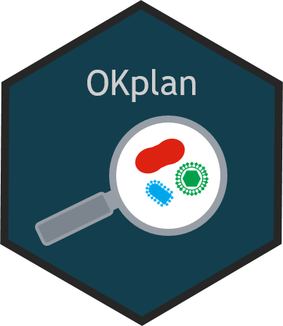

# OKplan: Tools to facilitate the Planning of the annual Surveillance Programmes 

<!-- README.md is generated from README.Rmd. Please edit that file -->

-   [Overview](#overview)
-   [Installation](#installation)
-   [Usage](#usage)
-   [Copyright and license](#copyright-and-license)
-   [Contributing](#contributing)

## Overview

`OKplan`provide tools to facilitate the planning of the annual
surveillance programmes. The main focus is tools for generating
standardized lists for NFSA.

`OKplan` is part of `NVIverse`, a collection of R-packages with tools to
facilitate data management and data reporting at the Norwegian
Veterinary Institute (NVI). The `NVIverse` consists of the following
packages: `NVIconfig`, `NVIdb`, `NVIspatial`, `NVIpretty`, `NVIbatch`,
`OKplan`, `OKcheck`, `NVIcheckmate`, `NVIpackager`, `NVIrpackages`. See
[Contribute to
OKplan](https://github.com/NorwegianVeterinaryInstitute/OKplan/blob/main/CONTRIBUTING.md)
for more information.

## Installation

`OKplan` is available at
[GitHub](https://github.com/NorwegianVeterinaryInstitute). To install
`OKplan` you will need:

-   R version > 4.0.0
-   R package `remotes`
-   Rtools 4.0 or Rtools 4.2 depending on R version

First install and attach the `remotes` package.

    install.packages("remotes")
    library(remotes)

To install (or update) the `OKplan` package, run the following code:

    remotes::install_github("NorwegianVeterinaryInstitute/OKplan",
        upgrade = FALSE,
        build = TRUE,
        build_vignettes = TRUE)

## Usage

The `OKplan` package needs to be attached.

    library(OKplan)

`OKplan`provide tools to facilitate the planning of the annual
surveillance programmes. The main focus is tools for generating
standardized lists for NFSA.

#### Further documentation

##### Help

The full list of all available functions and datasets can be accessed by
typing

    help(package = "OKplan")

##### Vignettes

Consult the vignettes for task-oriented help.

    vignette(package = "OKplan")

Vignettes in package `OKplan`:

-   Contribute to OKplan (html)

##### NEWS

Please check the
[NEWS](https://github.com/NorwegianVeterinaryInstitute/OKplan/blob/main/NEWS)
for information on new features, bug fixes and other changes.

## Copyright and license

Copyright (c) 2021 - 2023 Norwegian Veterinary Institute.  
Licensed under the BSD\_3\_clause License. See
[License](https://github.com/NorwegianVeterinaryInstitute/OKplan/blob/main/LICENSE)
for details.

## Contributing

Contributions to develop `OKplan` is highly appreciated. There are
several ways you can contribute to this project: ask a question, propose
an idea, report a bug, improve the documentation, or contribute code.
See [Contribute to
OKplan](https://github.com/NorwegianVeterinaryInstitute/OKplan/blob/main/CONTRIBUTING.md)
for more information.

## <!-- Code of conduct -->

Please note that the OKplan project is released with a [Contributor Code
of
Conduct](https://github.com/NorwegianVeterinaryInstitute/OKplan/blob/main/CODE_OF_CONDUCT.md).
By contributing to this project, you agree to abide by its terms.
